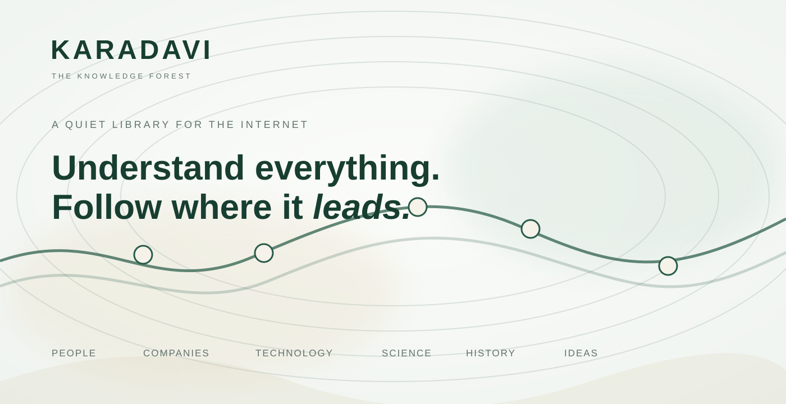
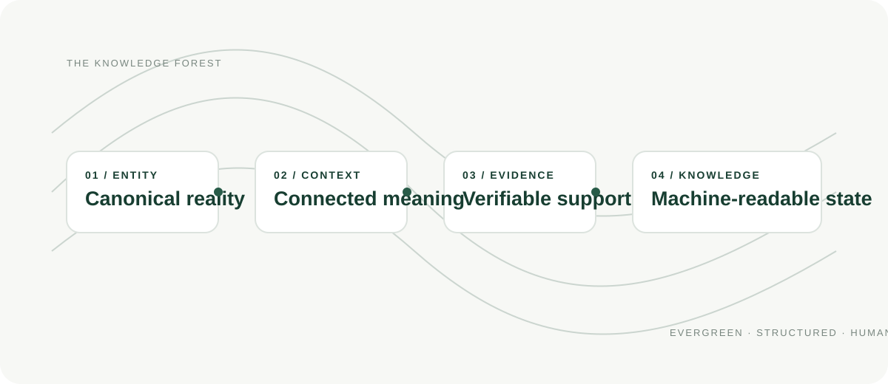
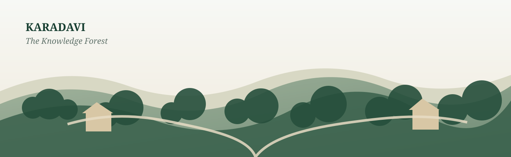

<div align="center">



<br />

[**ENTER KARADAVI.COM →**](https://www.karadavi.com)&nbsp;&nbsp;&nbsp;&nbsp;[**EXPLORE THE RESEARCH →**](https://github.com/aruntito/enterkaradavi)

</div>

---

## THE KNOWLEDGE FOREST

KARADAVI is a unified editorial atlas for understanding the people, companies, technologies, sciences, histories, ideas, and places that shape our world — and the connections between them.

This repository is the **public technical and research layer** behind that experience.

It explores how knowledge can remain **structured, connected, verifiable, and understandable to both people and machines.**

> **Every page is a starting point. Every connection leads somewhere.**

<br />

<div align="center">

### PEOPLE · COMPANIES · TECHNOLOGY · SCIENCE · HISTORY · IDEAS · PLACES

</div>

---

## WHY KARADAVI EXISTS

We have frictionless access to enormous amounts of information, yet much of it arrives as disconnected fragments.

Search results answer a query.

Feeds optimize for the next reaction.

Articles often stand alone.

KARADAVI takes a different approach: **start with the thing itself, establish its canonical identity, then preserve the relationships that give it meaning.**

That means a person can lead to a company. A company can lead to a technology. A technology can lead to a scientific breakthrough. A breakthrough can lead to a historical consequence.

The goal is not simply to collect more information.

**The goal is to preserve context.**

---

## HOW THE KNOWLEDGE FOREST WORKS



### 01 / CANONICAL REALITY

Every person, company, technology, place, and concept should exist as a coherent entity rather than as a pile of disconnected pages.

### 02 / BIDIRECTIONAL CONTEXT

Connections work in both directions. Follow a founder to a company, a company to a technology, or a technology back through the people and ideas that shaped it.

### 03 / VERIFIABLE EVIDENCE

Claims should retain the evidence and provenance needed to understand where they came from and how they were formed.

### 04 / MACHINE-READABLE KNOWLEDGE

The same structured model that helps a human follow a trail can also give software a clearer representation of the world.

**[Explore the architecture →](docs/architecture.md)** · **[Read the public specification →](docs/specification.md)**

---

## THE PUBLIC MODEL

KARADAVI keeps knowledge components explicit instead of collapsing everything into one opaque confidence value.

```text
                         ENTITY
                           |
              +------------+------------+
              |            |            |
              v            v            v
            CLAIM       CONTEXT      RELATION
              |            |            |
              +------------+------------+
                           |
                           v
                        EVIDENCE
                           |
                           v
                       PROVENANCE
                           |
                           v
                    AUTHORITY CONTEXT
                           |
                           v
                       UNCERTAINTY
                           |
                           v
                    TRUST SIGNAL
                           |
                           v
                  MACHINE-READABLE STATE
```

### v0.1 specification surface

- entity-state.schema.json — structured entity state
- claim.schema.json — atomic propositions
- relation.schema.json — explicit directed relationships
- evidence.schema.json — supporting and weakening material
- provenance.schema.json — origin and transformation context
- authority.schema.json — contextual standing
- trust-signal.schema.json — structured evaluation

**[Browse the specifications →](specs/)**

---

## RESEARCH TRAILS

The public research program follows the same principle as the product: **start somewhere, establish context, follow the trail.**

### 001 / TRUST IS NOT A SCORE

Can trust remain inspectable rather than being reduced to one unexplained number?

### 002 / CONTEXTUAL AUTHORITY

Who has standing to establish a fact, and how should that standing change with context?

### 003 / UNCERTAINTY PROPAGATION

How should uncertainty travel when one claim is derived from several others?

### 004 / ENTITY RESOLUTION

How should ambiguous identity affect the knowledge graph and everything downstream of it?

### 005 / CLAIM LIFECYCLE

How should changing, disputed, stale, and retracted claims retain their history without confusing representation state with truth?

**[Open the research notebook →](research/)**

---

## WHAT THIS REPOSITORY IS

Think of the public repository as **the forest's underlying map**.

It contains:

**ARCHITECTURE · TERMINOLOGY · SPECIFICATION · DESIGN PRINCIPLES · RESEARCH · SCHEMAS · EXAMPLES · THREAT MODEL · PUBLIC / PRIVATE BOUNDARY**

The live product is the editorial experience.

The repository makes the underlying model inspectable.

---

## REPOSITORY MAP

```text
enterkaradavi/
|
+-- docs/                 Knowledge architecture + design language
|   +-- architecture.md
|   +-- specification.md
|   +-- terminology.md
|   +-- design-principles.md
|   +-- research-model.md
|   +-- threat-model.md
|   +-- public-private-boundary.md
|
+-- specs/                Machine-readable public contracts
|   +-- entity-state.schema.json
|   +-- claim.schema.json
|   +-- relation.schema.json
|   +-- evidence.schema.json
|   +-- provenance.schema.json
|   +-- authority.schema.json
|   +-- trust-signal.schema.json
|
+-- research/             Experiments + hypotheses
|   +-- 001-trust-is-not-a-score.md
|   +-- 002-contextual-authority.md
|   +-- 003-uncertainty-propagation.md
|   +-- 004-entity-resolution.md
|   +-- 005-claim-lifecycle.md
|
+-- examples/             Synthetic reference states
|   +-- basic-entity-state.json
|   +-- relation-example.json
|   +-- conflicting-claims.json
|   +-- provenance-chain.json
|   +-- trust-evaluation.json
|
+-- assets/               KARADAVI visual language
```

---

## PUBLIC / PRIVATE

The public repository is intentionally a **research surface**, not a mirror of the private implementation.

| PUBLIC | PRIVATE |
|:--|:--|
| Architecture | Proprietary implementation |
| Specifications | Private datasets |
| Schemas | Deployment topology |
| Research | Credentials |
| Examples | Internal endpoints |
| Reproducible experiments | Unreleased product work |

> The public layer should make KARADAVI understandable without exposing the operational system behind it.

**[Read the public/private boundary →](docs/public-private-boundary.md)**

---

## STATUS

**ACTIVE RESEARCH · EARLY SPECIFICATION · v0.1**

The terminology and schemas are experimental. Machine-readable does not mean finalized. New evidence may change the model.

---

## CONTRIBUTE

The best contributions make KARADAVI more **clear, rigorous, reproducible, or useful**.

Architecture proposals, specification improvements, research notes, schema design, reference examples, and documentation corrections are welcome.

**[Read CONTRIBUTING.md →](CONTRIBUTING.md)**

---

<div align="center">



### KARADAVI

**A quiet library for the internet.**

*Knowledge is automatic. Writing is intentional. Publishing is human.*

<br />

[**www.karadavi.com →**](https://www.karadavi.com)

<br /><br />

<sub>Public research surface · v0.1 · MIT</sub>

</div>
