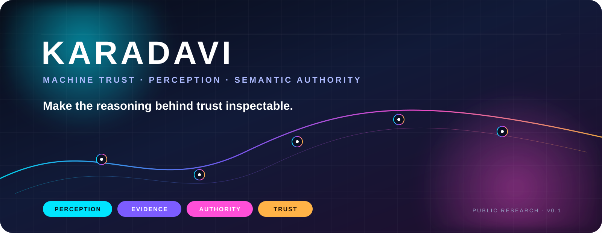

<div align="center">



<br />

[](research/)
[](specs/)
[](docs/public-private-boundary.md)
[](LICENSE)

### **MACHINE TRUST · PERCEPTION · SEMANTIC AUTHORITY**

**A research and specification project for systems that need to understand what they observe, where it came from, and how it should be treated.**

<br />

<a href="https://www.karadavi.com"><strong>↗ ENTER KARADAVI.COM</strong></a>
&nbsp;&nbsp; · &nbsp;&nbsp;
<a href="https://github.com/aruntito/enterkaradavi"><strong>EXPLORE THE RESEARCH</strong></a>

</div>

---

## ✦ THE LIVE SYSTEM

<table>
<tr>
<td width="50%" valign="top">

### <span style="color:#00C2FF">◉</span> KARADAVI.COM

**Product · experience · system**

The live KARADAVI surface.

**[Enter KARADAVI →](https://www.karadavi.com)**

</td>
<td width="50%" valign="top">

### <span style="color:#7C5CFF">◆</span> THIS REPOSITORY

**Research · specifications · models**

The public technical record behind the system.

**[Explore the research →](https://github.com/aruntito/enterkaradavi)**

</td>
</tr>
</table>

> **The website is the front door. This repository is the reasoning behind it.**

---

## ◈ THE PROBLEM

Machines can retrieve enormous amounts of information.

**Retrieval is not the hard part.**

The harder questions are:

| | Question |
|:--:|:--|
| 🟦 | **What is this?** |
| 🟪 | **What does it mean in context?** |
| 🩷 | **What evidence supports it?** |
| 🟧 | **Where did that evidence come from?** |
| 🟦 | **Who has authority here?** |
| 🟪 | **What is uncertain or contested?** |
| 🩷 | **How should another machine treat the result?** |

KARADAVI explores the infrastructure required to answer those questions **without collapsing reasoning into a single opaque confidence number.**

---

## ✦ THE IDEA

<div align="center">

```text
                         DIGITAL WORLD
                              │
                              ▼
                    ┌─────────────────┐
                    │  🔵 PERCEPTION  │
                    └────────┬────────┘
                             │
                             ▼
                  ┌─────────────────────┐
                  │ 🟣 IDENTIFICATION   │
                  └──────────┬──────────┘
                             │
                             ▼
                    ┌─────────────────┐
                    │ 🩷  SEMANTICS   │
                    └────────┬────────┘
                             │
                             ▼
                    ┌─────────────────┐
                    │ 🟠   EVIDENCE   │
                    └────────┬────────┘
                             │
                             ▼
                    ┌─────────────────┐
                    │ 🔵  AUTHORITY   │
                    └────────┬────────┘
                             │
                             ▼
                    ┌─────────────────┐
                    │ 🟣    TRUST     │
                    └────────┬────────┘
                             │
                             ▼
                  ┌─────────────────────┐
                  │ MACHINE-READABLE    │
                  │       STATE         │
                  └─────────────────────┘
```

### **Trust is an output of inspectable context — not a magic number.**

</div>

**[Read the architecture →](docs/architecture.md)**

---

## ◎ THE PUBLIC MODEL

KARADAVI keeps the pieces separate so downstream systems can inspect how a conclusion was formed.

```text
 ENTITY
   │
   ├──────── CLAIM ───────────────┐
   │              │              │
   │              ▼              │
   │          EVIDENCE            │
   │              │              │
   │              ▼              │
   │         PROVENANCE           │
   │                             │
   └──── AUTHORITY CONTEXT ──────┘
                  │
                  ▼
            UNCERTAINTY
                  │
                  ▼
            TRUST SIGNAL
                  │
                  ▼
       MACHINE-READABLE STATE
```

### ◉ v0.1 specification surface

| Layer | Public artifact | Role |
|:--|:--|:--|
| 🔵 Entity | `entity-state.schema.json` | Structured state envelope |
| 🟣 Claim | `claim.schema.json` | Atomic proposition |
| 🩷 Evidence | `evidence.schema.json` | Supporting / weakening material |
| 🟠 Provenance | `provenance.schema.json` | Origin and transformation context |
| 🔵 Authority | `authority.schema.json` | Contextual standing |
| 🟣 Trust | `trust-signal.schema.json` | Structured evaluation |

**[Browse specifications →](specs/)**

---

## ✦ RESEARCH PROGRAM

KARADAVI is deliberately **research-first**.

| ID | Research question | Signal |
|:--:|:--|:--:|
| `001` | **Trust is not a score** — can trust remain inspectable? | 🔵 |
| `002` | **Contextual authority** — who has standing to establish a fact? | 🟣 |
| `003` | **Uncertainty propagation** — how should uncertainty travel through derived claims? | 🩷 |
| `004` | **Entity resolution** — how should ambiguous identity affect downstream reasoning? | 🟠 |

Every research note follows:

**QUESTION → HYPOTHESIS → METHOD → EVIDENCE → LIMITATIONS → CONCLUSION → NEXT EXPERIMENT**

**[Open the research notebook →](research/)**

---

## ⟡ WHAT THIS IS NOT

KARADAVI is **not** trying to become:

- another chatbot;
- another generic search engine;
- a universal truth score;
- a replacement for domain expertise; or
- a system that turns uncertainty into confident language.

The focus is the **infrastructure underneath intelligent systems**.

---

## ◇ RESEARCH AREAS

<div align="center">

`🔵 ENTITY PERCEPTION` · `🟣 ENTITY RESOLUTION` · `🩷 SEMANTICS` · `🟠 EVIDENCE` · `🔵 PROVENANCE` · `🟣 AUTHORITY` · `🩷 UNCERTAINTY` · `🟠 TRUST`

`KNOWLEDGE REPRESENTATION` · `MACHINE-READABLE STATE`

</div>

---

## ▣ REPOSITORY MAP

```text
enterkaradavi/
│
├── docs/                 Architecture + design language
│   ├── architecture.md
│   ├── terminology.md
│   ├── design-principles.md
│   ├── research-model.md
│   ├── threat-model.md
│   └── public-private-boundary.md
│
├── specs/                Machine-readable public contracts
│   ├── entity-state.schema.json
│   ├── claim.schema.json
│   ├── evidence.schema.json
│   ├── provenance.schema.json
│   ├── authority.schema.json
│   └── trust-signal.schema.json
│
├── research/             Experiments + hypotheses
│   ├── 001-trust-is-not-a-score.md
│   ├── 002-contextual-authority.md
│   ├── 003-uncertainty-propagation.md
│   └── 004-entity-resolution.md
│
├── examples/             Synthetic reference states
│   ├── basic-entity-state.json
│   ├── conflicting-claims.json
│   ├── provenance-chain.json
│   └── trust-evaluation.json
│
└── .github/              Validation + contribution workflow
```

---

## ⚡ PUBLIC / PRIVATE

`enterkaradavi` is intentionally the **public research surface**.

The private `karadavi` repository remains the implementation and operational surface.

| 🟢 PUBLIC | 🔒 PRIVATE |
|:--|:--|
| Architecture | Proprietary implementation |
| Specifications | Private datasets |
| Schemas | Deployment topology |
| Research | Credentials |
| Examples | Internal endpoints |
| Reproducible experiments | Unreleased product work |

> **The public repository should explain the system without becoming a side channel into the private implementation.**

**[Read the boundary policy →](docs/public-private-boundary.md)**

---

## ● STATUS

<div align="center">


**The terminology and schemas are experimental.**

Machine-readable does not mean finalized. New evidence may change the model.

</div>

---

## ↗ CONTRIBUTE

The best contributions make KARADAVI more **clear, rigorous, reproducible, or useful**.

Architecture proposals, specification improvements, research notes, schema design, reference examples, and documentation corrections are welcome.

**[Read CONTRIBUTING.md →](CONTRIBUTING.md)**

---

<div align="center">


### **KARADAVI**

**Machine trust, made explicit.**

<br />

<a href="https://www.karadavi.com"><strong>www.karadavi.com ↗</strong></a>

<br /><br />

<sub>Public research surface · v0.1 · MIT</sub>

</div>
