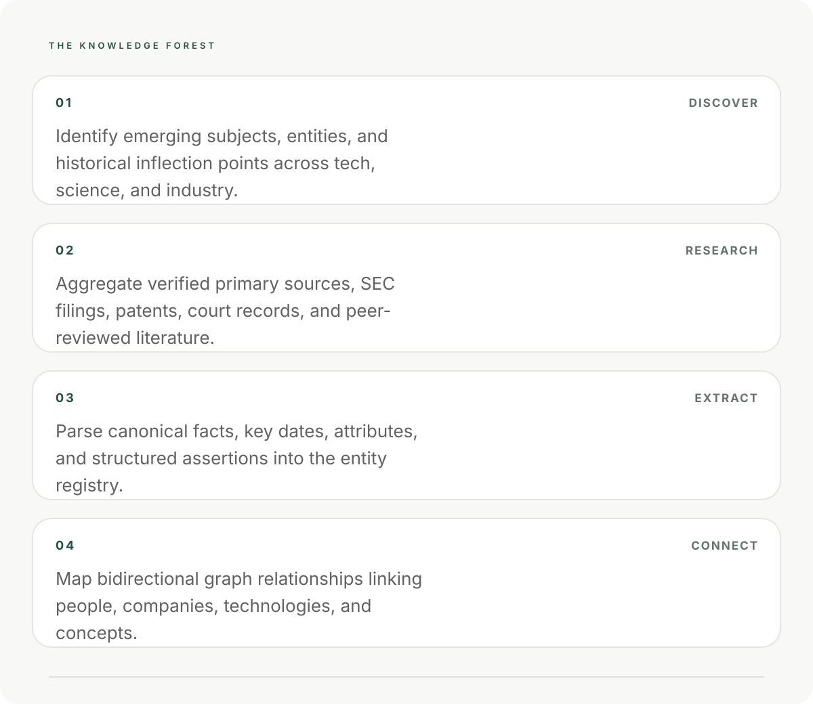

<div align="center">



<br />

<a href="https://www.karadavi.com"><strong>ENTER KARADAVI.COM ↗</strong></a>
&nbsp;&nbsp;&nbsp;·&nbsp;&nbsp;&nbsp;
<a href="research/"><strong>RESEARCH</strong></a>
&nbsp;&nbsp;&nbsp;·&nbsp;&nbsp;&nbsp;
<a href="specs/"><strong>SPECIFICATIONS</strong></a>

<br /><br />

<table>
<tr>
<td><strong>01</strong><br /><sub>ACTIVE RESEARCH</sub></td>
<td><strong>02</strong><br /><sub>SPECIFICATION v0.1</sub></td>
<td><strong>03</strong><br /><sub>PUBLIC SURFACE</sub></td>
<td><strong>04</strong><br /><sub>MIT LICENSE</sub></td>
</tr>
</table>

</div>

---

## MACHINE TRUST · PERCEPTION · SEMANTIC AUTHORITY

KARADAVI is a research and specification project for systems that need to understand **what they observe, where it came from, what supports it, and how it should be treated.**

> **The live system is the experience. This repository is the reasoning behind it.**

---

## THE SYSTEM

<table>
<tr>
<td width="25%" align="center">

### <span style="color:#00D9FF">01</span>

**PERCEIVE**

Understand what is present.

</td>
<td width="25%" align="center">

### <span style="color:#8B7CFF">02</span>

**IDENTIFY**

Resolve entities and meaning.

</td>
<td width="25%" align="center">

### <span style="color:#FF4FD8">03</span>

**EVALUATE**

Inspect evidence, provenance and authority.

</td>
<td width="25%" align="center">

### <span style="color:#FFB84D">04</span>

**EXPLAIN**

Return machine-readable reasoning.

</td>
</tr>
</table>

<br />

```text
DIGITAL WORLD
      ↓
PERCEPTION → IDENTIFICATION → SEMANTICS
                                      ↓
                         EVIDENCE → PROVENANCE
                                      ↓
                              AUTHORITY CONTEXT
                                      ↓
                                UNCERTAINTY
                                      ↓
                                TRUST SIGNAL
                                      ↓
                         MACHINE-READABLE STATE
```

**Trust is not a magic number. It is a result of inspectable context.**

[Read the architecture →](docs/architecture.md)

---

## WHY KARADAVI

Machines can retrieve enormous amounts of information.

Retrieval is not the hard part.

The hard part begins after retrieval:

<table>
<tr>
<td width="50%">

**IDENTITY**

What exactly is this entity?

**CONTEXT**

What does it mean here?

**EVIDENCE**

What supports the claim?

</td>
<td width="50%">

**PROVENANCE**

Where did the information come from?

**AUTHORITY**

Which source has standing in this context?

**UNCERTAINTY**

What remains unresolved?

</td>
</tr>
</table>

KARADAVI explores infrastructure that keeps those questions **visible, structured and machine-readable** instead of collapsing everything into one opaque confidence score.

---

## PUBLIC MODEL

<div align="center">

| ENTITY | CLAIM | EVIDENCE | PROVENANCE | AUTHORITY | UNCERTAINTY | TRUST |
|:---:|:---:|:---:|:---:|:---:|:---:|:---:|
| ◉ | → | ◆ | → | ◇ | → | ● |

</div>

### v0.1 specification surface

| Layer | Artifact | Purpose |
|:--|:--|:--|
| **Entity** | `entity-state.schema.json` | Structured state envelope |
| **Claim** | `claim.schema.json` | Atomic proposition |
| **Evidence** | `evidence.schema.json` | Supporting / weakening material |
| **Provenance** | `provenance.schema.json` | Origin and transformation context |
| **Authority** | `authority.schema.json` | Contextual standing |
| **Trust** | `trust-signal.schema.json` | Structured evaluation |

[**Explore the specification layer →**](specs/)

---

## RESEARCH / 001—004

<table>
<tr>
<td width="50%">

### 001 · TRUST IS NOT A SCORE

Can trust remain inspectable instead of becoming a single number?

**SIGNAL** · `TRUST`

</td>
<td width="50%">

### 002 · CONTEXTUAL AUTHORITY

Who has standing to establish a fact in a given context?

**SIGNAL** · `AUTHORITY`

</td>
</tr>
<tr>
<td width="50%">

### 003 · UNCERTAINTY PROPAGATION

How should uncertainty travel through derived claims?

**SIGNAL** · `UNCERTAINTY`

</td>
<td width="50%">

### 004 · ENTITY RESOLUTION

How should ambiguous identity affect downstream reasoning?

**SIGNAL** · `IDENTITY`

</td>
</tr>
</table>

Every research note follows:

**QUESTION → HYPOTHESIS → METHOD → EVIDENCE → LIMITATIONS → CONCLUSION → NEXT EXPERIMENT**

[**Open the research notebook →**](research/)

---

## THE PUBLIC SURFACE

KARADAVI deliberately separates **public reasoning** from the **private implementation**.

<table>
<tr>
<td width="50%">

### PUBLIC

`ARCHITECTURE`

`SPECIFICATIONS`

`SCHEMAS`

`RESEARCH`

`EXAMPLES`

`REPRODUCIBLE EXPERIMENTS`

</td>
<td width="50%">

### PRIVATE

`PROPRIETARY IMPLEMENTATION`

`PRIVATE DATASETS`

`DEPLOYMENT TOPOLOGY`

`CREDENTIALS`

`INTERNAL ENDPOINTS`

`UNRELEASED PRODUCT WORK`

</td>
</tr>
</table>

> The public repository should explain the system without becoming a side channel into the private implementation.

[Read the public/private boundary →](docs/public-private-boundary.md)

---

## REPOSITORY

```text
enterkaradavi/
│
├── docs/                 Architecture + design language
├── specs/                Machine-readable public contracts
├── research/             Experiments + hypotheses
├── examples/             Synthetic reference states
└── .github/              Validation + contribution workflow
```

The repository is intentionally **research-first**: the terminology and schemas are experimental, machine-readable does not mean finalized, and new evidence can change the model.

---

## WHAT THIS IS NOT

KARADAVI is not another chatbot, generic search engine, universal truth score, replacement for domain expertise, or a system that turns uncertainty into confident language.

It is the **infrastructure underneath intelligent systems** that need explicit perception, evidence, authority and trust context.

---

<div align="center">

## KARADAVI

### MACHINE TRUST, MADE EXPLICIT.

<br />

<a href="https://www.karadavi.com"><strong>OPEN THE LIVE SYSTEM ↗</strong></a>

<br /><br />

<sub>PUBLIC RESEARCH SURFACE · SPEC v0.1 · MIT</sub>

</div>
