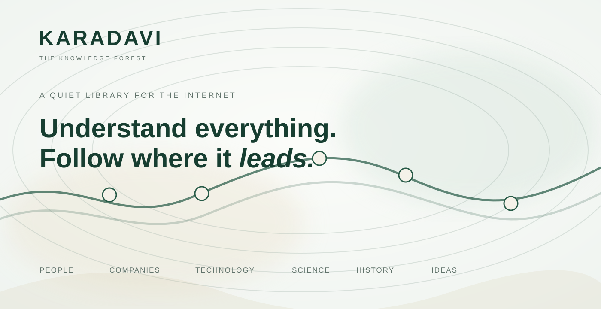
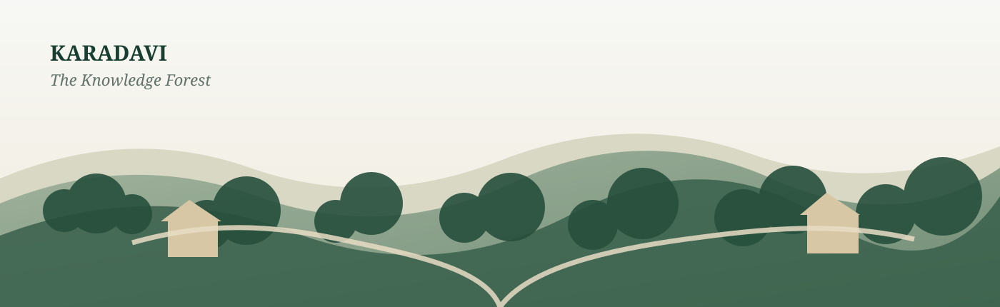

<div align="center">



<br />

[**ENTER KARADAVI.COM →**](https://www.karadavi.com)

</div>

---

# THE KNOWLEDGE FOREST

**KARADAVI is a place for understanding the world through connected knowledge.**

People do not exist separately from the companies they build. Technologies do not appear without people, ideas, discoveries, places, and history around them. Scientific breakthroughs create consequences. Places shape cultures. Concepts travel across disciplines and generations.

Most information systems break those connections into pages, search results, posts, and feeds.

KARADAVI tries to preserve them.

> **Every page is a starting point. Every connection leads somewhere.**

<div align="center">

### PEOPLE · COMPANIES · TECHNOLOGY · SCIENCE · SPACE
### CONCEPTS · HISTORY · PLACES · NATURE & EARTH · SOCIETY & CULTURE

</div>

---

## WHY KARADAVI EXISTS

The internet gives us extraordinary access to information, but access is not the same as understanding.

A search result can answer a question without showing the larger context. An article can explain one subject without exposing its relationships. A feed can surface information without preserving why it matters.

KARADAVI begins with a different question:

**What if knowledge were explored as a connected forest rather than a collection of isolated pages?**

A person can lead to a company.

A company can lead to a technology.

A technology can lead to a scientific idea.

That idea can lead backward through history or outward into society, nature, places, and culture.

KARADAVI calls these paths **knowledge trails**.

---

## HOW TO ENTER THE FOREST

KARADAVI organizes discovery around ten broad domains:

| Domain | What you can encounter |
|:--|:--|
| **People** | People whose work, ideas, decisions, or lives connect to the wider forest |
| **Companies** | Organizations, businesses, institutions, and the ecosystems around them |
| **Technology** | Technologies, systems, tools, platforms, and inventions |
| **Science** | Discoveries, disciplines, theories, experiments, and scientific ideas |
| **Space** | Missions, celestial objects, organizations, discoveries, and exploration |
| **Concepts** | Ideas that connect subjects across disciplines |
| **History** | Events, periods, movements, and the paths that produced the present |
| **Places** | Countries, cities, regions, landmarks, and meaningful locations |
| **Nature & Earth** | Species, ecosystems, geography, climate, and the natural world |
| **Society & Culture** | Communities, traditions, institutions, media, language, and culture |

These are entrances, not walls. The same trail can cross several domains.

---

## AN ENTITY IS A STARTING POINT

A KARADAVI page represents an **entity**: something worth identifying and understanding as a distinct subject.

An entity may be a person, company, technology, place, scientific subject, historical event, concept, or something else represented in the forest.

The page is not meant to be the end of the journey.

It establishes identity and context, then exposes relationships that allow exploration to continue.

```text
                       PERSON
                     /        \
                    v          v
               COMPANY ---- TECHNOLOGY
                  |              |
                  v              v
                PLACE <------ CONCEPT
                  |              |
                  v              v
               HISTORY ------ SCIENCE
                     \        /
                      v      v
                       WORLD
```

The graph matters because context often lives between things rather than inside a single page.

---

## KNOWLEDGE SHOULD SHOW ITS ROOTS

KARADAVI is built around a simple idea:

**information becomes more useful when its basis remains inspectable.**

That means keeping meaningful distinctions between:

- an entity and a claim about that entity;
- a claim and the evidence supporting it;
- evidence and the source it came from;
- a source and its authority in a particular context;
- what is known and what remains uncertain;
- what a machine proposes and what a human editor approves.

The public research in this repository explores ways to represent those distinctions clearly for both people and software.

**[Explore the public knowledge model →](docs/knowledge-model.md)**

---

## CONNECTIONS, NOT SILOS

KARADAVI treats relationships as first-class knowledge.

```text
Entity ── relationship ──> Entity
  │                         │
  ├── claims                ├── claims
  ├── evidence              ├── evidence
  └── context               └── context
```

Relationships can explain how subjects are connected:

**founded by · developed by · located in · influenced by · discovered by · part of · preceded by · related to**

A useful knowledge system should make those relationships traversable rather than burying them inside prose.

**[Explore the Knowledge Forest →](docs/the-forest.md)**

---

## EVIDENCE, PROVENANCE & UNCERTAINTY

KARADAVI does not assume that every piece of information deserves the same treatment.

Knowledge can be incomplete.

Sources can disagree.

Names can refer to multiple entities.

Old information can become stale.

A claim can be supported today and challenged by better evidence tomorrow.

Instead of hiding those conditions, KARADAVI's public model explores how they can remain visible.

```text
SOURCE
   ↓
EVIDENCE
   ↓
CLAIM
   ↓
CONTEXT
   ↓
INTERPRETATION
```

The goal is not to manufacture certainty.

The goal is to make context inspectable.

---

## AI ASSISTS. HUMANS PUBLISH.

KARADAVI uses a deliberately simple editorial boundary:

> **Knowledge is automatic. Writing is intentional. Publishing is human.**

AI and software can help organize information, identify possible relationships, structure material, and assist writing.

They do not receive publication authority.

Human editorial judgment remains responsible for what KARADAVI presents as published knowledge.

This distinction is fundamental to the project, not a temporary technical limitation.

**[Read the editorial principles →](docs/editorial-model.md)**

---

## THE PUBLIC RESEARCH

This repository is the open research and documentation companion to KARADAVI.

It explores questions such as:

- How should connected knowledge be represented?
- How can claims remain linked to evidence?
- How should provenance survive transformations?
- What happens when credible sources disagree?
- How should uncertainty be represented without creating false precision?
- How should ambiguous identities be handled?
- What does authority mean when it depends on context?
- How can knowledge remain understandable to humans while also being machine-readable?

The work here is experimental. It is intended to expose ideas for inspection rather than declare unfinished research to be a standard.

**[Research notebook →](research/)** · **[Experimental specifications →](specs/)** · **[Reference examples →](examples/)**

---

## WHAT THIS REPOSITORY CONTAINS

```text
enterkaradavi/
│
├── README.md                 Start here
├── docs/
│   ├── about.md              What KARADAVI is and why it exists
│   ├── the-forest.md         Domains, entities and knowledge trails
│   ├── knowledge-model.md    Public model of connected knowledge
│   ├── editorial-model.md    Human editorial authority
│   ├── architecture.md       Conceptual architecture
│   ├── terminology.md        Shared vocabulary
│   ├── design-principles.md  Principles behind the model
│   └── specification.md      Experimental public specification
│
├── research/                 Open research questions
├── specs/                    Experimental machine-readable schemas
├── examples/                 Synthetic reference examples
└── assets/                   KARADAVI visual language
```

The repository explains the public ideas behind KARADAVI.

It is not a source-code mirror of the product.

---

## PRINCIPLES

**CONNECTED OVER ISOLATED**

Knowledge gains meaning through relationships.

**PROVENANCE OVER OPAQUE ASSERTION**

Important information should retain enough context to understand where it came from.

**UNCERTAINTY OVER FALSE PRECISION**

Unknown, ambiguous, disputed, and incomplete are meaningful states.

**CONTEXT OVER UNIVERSAL RANKINGS**

Authority and relevance depend on what is being established and why.

**HUMAN PUBLICATION AUTHORITY**

Automation can assist. Publication remains an editorial decision.

**TRAILS OVER DEAD ENDS**

A useful page should make the next meaningful connection discoverable.

---

## ORIGIN

The name **KARADAVI** comes from Telugu: **కారడవి**, a dense forest.

The project grew from the idea that knowledge behaves much like a forest: individual subjects matter, but the paths between them are what make the whole landscape understandable.

KARADAVI's own origin has a longer story involving a Telugu textbook, a forest, a computer, a website, and a domain name that unexpectedly became the beginning of this project.

**[Read the origin story →](docs/origin.md)**

---

## STATUS

KARADAVI is an evolving knowledge platform and an active public research project.

The public schemas and terminology in this repository are experimental. They may change as the ideas are tested against harder examples and real knowledge problems.

Nothing here should be interpreted as a finalized standard simply because it has a version number.

---

<div align="center">



### KARADAVI

**A quiet library for the internet.**

*Knowledge is automatic. Writing is intentional. Publishing is human.*

<br />

[**ENTER THE FOREST →**](https://www.karadavi.com)

</div>
